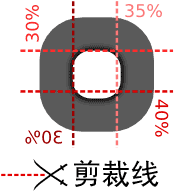
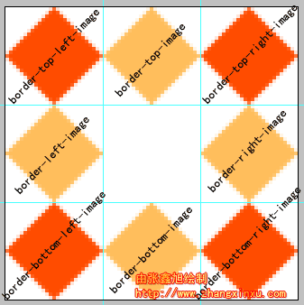

# border
- `border-style`
- `border-width`
- `border-radius`
- `border-color`
- `border-image`

## border-radius
### 语法
`border-radius:none | <length>{1,4} [/<length>{1, 4}] ?`

### 取值
<length>： 由浮点数字和单位标识符组成的长度值。不可为负值。

### 说明
border-radius是一种缩写方法。如果"/"前后的值都存在，那么"/"前面的值设置其水平半径，"/"后面值设置其垂直半径。如果没有"/"，则水平和垂直半径相等。另外其四个值是按照top-left、top-right、bottom-right、bottom-left的顺序来设置的其主要会有下面几种情形出现：
1. border-radius: [ <length>{1,4} ]; //这里只有一个值，那么top-left、top-right、bottom-right、bottom-left四个值相等
2. border-radius:[ <length>{1,4} ]  [ <length>{1,4} ] ; //这里设置两个值，那么top-left等于bottom-right，并且取第一个值；top-right等于bottom-left，并且取第二个值
3. border-radius:[ <length>{1,4} ]   [ <length>{1,4} ]   [ <length>{1,4} ];//如果有三个值，其中第一个值是设置top-left;而第二个值是top-right和bottom-left并且他们会相等,第三个值是设置bottom-right
4. border-radius:[ <length>{1,4} ]   [ <length>{1,4} ]  [ <length>{1,4} ]   [ <length>{1,4} ];//如果有四个值，其中第一个值是设置top-left;而第二个值是top-right,第三个值bottom-right,第四个值是设置bottom-left

前面，我们主要看了border-radius的缩写格式，其实border-radius和border属性一样，还可以把各个角单独拆分出来，也就是以下四种写法:

```
border-top-left-radius:<length> <length>//左上角
border-top-right-radius:<length> <length>//右上角
border-bottom-right-radius:<length>  <length>  //右下角
border-bottom-left-radius:<length>  <length>   //左下角
```

这里说一下，各角拆分出来取值方式：<length> <length>中第一个值是圆角水平半径，第二个值是垂直半径,如果第二个值省略，那么其等于第一个值，这时这个角就是一个四分之一的圆角，如果任意一个值为0，那么这个角就不是圆角。

## border-colors

## border-image
### 语法

```css
border-image: none | <image> [ <number> | <percentage>]{1,4} [ / <border-width>{1,4}] ? [ stretch | repeat | round ] {0, 2}
```

### 参数介绍

* ``none``: 是border-image的背景图片的默认值，表示边框无背景图片
* ``<image>``: 背景图片的源，使用绝对或者相对的url地址来指定背景图片
* ``<number>``: number是一个数值，用来设置边框的宽度，其单位是px，其实就像border-width一样取值，可以使用1~4个值，其具体表示四个方
位的值
* ``<percentage>``: percntage也是用来设置边框的宽度，跟number不同之处是，其使用的是百分比值来设置边框宽度
* ``stretch,repeat,round``: 他们是用来设置边框背景图片的铺放方式，其中stretch是拉伸，repeat是重复，round是平铺，stretch为默认值

### 参数详解

总结来说，``border-image``的参数就是三点：图片，剪裁位置，重复性。

1. 图片(border-image-source)

具体和上面介绍一样

2. 图片剪裁位置(border-image-slice)
  1. 没有单位，专指像素。
  2. 支持百分比值，百分比值大小是相对于边框图片而言，假设边框图片大小为400px * 300px，则20%的实际效果就是剪裁了图片的 60px 80px 60px 80px的四边大小。
  3. 剪裁特性。就是将边框图片四分五裂，然后重新安置，变形。其有1-4个参数，其方位规则符合css普遍的方位规则，上右下左顺时针，再赋予剪裁的特性。举个例子，前面提到，支持百分比宽度，所以这里“30% 35% 40% 30%的”示意可以用下图表示：

  

  通过图，可以很清楚的理解，其实就是离图片上部30%的地方剪裁一些，在右边35%的地方剪裁一些，在离底部40%的地方剪裁一些，在距左边30%的地方也剪裁一下。于是总共对图片进行了四次剪裁，形成了九个分离的区域。这就是 “九宫格” 模型。

3. 重复性(border-image-repeat)

这里的重复和通常的不同。repeat（重复）只是其中之一，其余两个是round（平铺）和stretch（拉伸）。其中，stretch是默认值。

参数0~2,0则使用默认值--stretch，例如：``border-image:url(border.png) 30% 40%;`` 就等于 ``border-image:url(border.png) 30% 40% stretch stretch;``；1则表示水平方向及垂直方向均使用此参数。2个参数的话就是第一个水平，第二个垂直方向。

### 深入理解border-image的宽度和展示方式

我们将使用下面这个图来深入理解borer-image。


边框将border-image分成了九部分：border-top-image , border-right-image , border-bottom-image , border-left-image, border-top-left-image , border-top-right-image , border-bottom-left-image , border-bottom-right-image以及中间的内容区域。假设现在边框的宽度是27像素，则上面所说的九部分正如下图所表示的（放大400%）：




橙红色的四个边角的菱形区域称为"角边框图片"，在``border-image``中，角边框图片是没有任何展示效果的，不会平铺，不会重复，也不会拉伸，
有点类似与视觉中的盲点的意思。

而对边的四个橙黄色区域属于展示效果的作用区(也是边框宽度计算剩余区)，上下区域即 ``border-top-image`` 和 ``border-bottom-image`` 区域受到展示效果属性的第一个参数——水平方向效果影响，如果为 ``repeat`` ,则此区域图片会水平重复，如果是 ``round`` ，则此框框内的图片
会水平平铺，如果是 ``stretch`` ，则此矩形域中的图片就会被水平拉伸。左右区域只有垂直方向上的效果，与上下区域效果对应，不多说。

中间的区域（左图的空白格）受到全部参数的作用，在水平和垂直两个维度上都有展示效果（平铺、拉伸等）。

对于平铺和重复的区别：平铺可能会改变了原图片 **显示的大小** ;重复不改变图片显示的大小，可能会导致图片残缺。

这里有一个示意图: [示意图](http://image.zhangxinxu.com/flash/blog/201001/border_image.swf)

### 关于简写

如果要加上边框宽度的话，其书写方式为: ``border-image: url() 20 / 10px;``

### 参考内容

http://www.zhangxinxu.com/wordpress/2010/01/css3-border-image/
http://www.w3cplus.com/content/css3-border-image
