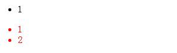
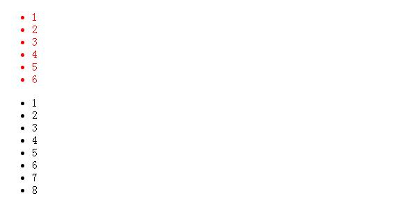
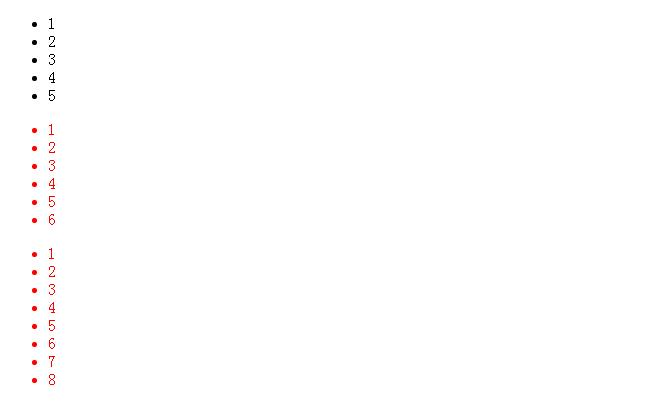
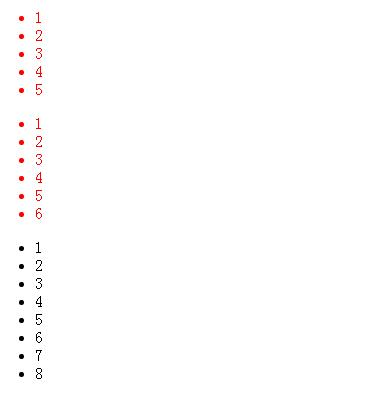
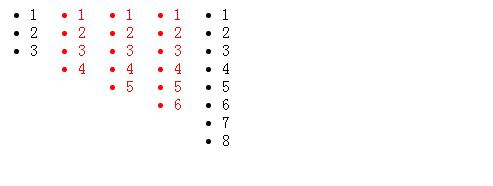

# 数量查询技术
**CSS的数量查询是通过元素的数量来应用不同的样式的技术。**

在CSS中至今为止都没有提供一个明确的计数API，但我们可以 **通过CSS3的伪类选择器解决同样的问题**。

伪类的相关知识，请看[CSS Selector](../Selector/summary.md)

## 选择一个元素
在CSS3中的`:only-child`和`:only-of-type`都可以选择只有一个子元素。来看一个实例:

```html
<ul>
  <li>1</li>
</ul>
<ul>
  <li>1</li>
  <li>2</li>
</ul>
```

```css
li:only-child{
  color:red;
}
```

效果:


反过来，_除了只有一个`li`的列表，其他的`ul`中的`li`都被选中_。基于上面的示例，**使用`` `:not(only-child)``选择器`** 选择列表项目数大于1的所有列表的`li`:

```css
li:not(:only-child) {
  color:red;
}
```

效果:



## 选择n个元素
例如:我们要选择列表为6个`li`的`ul`。

用到的知识:
1. 在CSS中`:nth-last-child(n)`选择器，可以从后面开始遍历`n`个参数。**也就是选择倒数第`n`个**。_假设列表中没有`n`个`li`时，将会直接忽略_。所以我们可以这样，选择到`ul`的`li`大于或等于6的列表中的第六个`li`。
2. 对于多于6个`li`的列表，我们是不需要的。通过 _多层伪类选择器_，**在原选择器基础上添加`:first-child`来做数量的过渡**。这样我们选择到了只有6个`li`的列表的第一个li元素。
3. 而要选择这个列表中的所有`li`时，可以通过`~`选择器来完成选择第2个到6个li。
4. 最后我们结合上面的选择器，得到我们要的效果:

```css
li:nth-last-child(6):first-child,
li:nth-last-child(6):first-child~li{
  color:red;
}
```

效果如下:



## 数大于或等于N个
例如:这回要找的是大于或等于有6个li的ul。

需要知道的知识:
1. 前面的示例可以得知:nth-last-child(n)可以选择到倒数第n个li。在CSS选择器中和:nth-last-child()有一个刚好相反的选择器:`nth-child()`，其也可以添加相应的参数，比如 **n或者n + [整数]**。例如:_nth-child(n + 6)会选择列表中第六个li后所有li(包括第6个)_
2. _我们要解决的问题时，选择匹配的li是不包括后面的五个_，这样一来就可以使用与`:nth-child(n + 6)`相反的选择器`:nth-last-child(n + 6)`。:nth-last-child(n + 6)将会从列表的中的倒数第六个li开始计算，直到没有匹配的li停止。**这样只要是大于6个`li`的列表，从第六个开始都开始匹配，由此可以作为判断是否具有大于等于6个`li`列表的依据了。** 目前的效果就是大于等于6个`li`的列表，从第六个开始匹配。还差剩下的5个`li`。
3. 最后通过`:nth-last-child(n+6)`结合`:nth-last-child(n+6)~li`完成所有`li`的选择。

```css
li:nth-last-child(n + 6),
li:nth-last-child(n + 6) ~ li{
  color:red
}
```

效果图:



## 数小于或等于N
前面实现选择列表有N个和大于或等于N个的li。其实有的时候，我们需要选择列表小于或等于N的。_打个比方，如果N=6，那么需要选择列表包含有6、5、4、3 、2和1的li的列表。_

需要知道的知识:
1. 大家都知道:nth-last-child(n+6)会在列表项目数大于或等于6个的列表倒第六个开会匹配选中。那么我们换个思路，**使用`:nth-last-child(-n + 6)`从每个列表中倒数第一个一直选择倒数第六个li。这个时候，只要列表有li都会找到匹配的li**。这并不是咱们需要的效果，理想中是在列表项目数大于六个的列表中应该没有匹配的li。
2. 通过`:first-child`来筛选出`li`大于6个的列表。
3. 最后通过结合`~`选择器来把剩余的`li`匹配到就可以了。

```css
li:nth-last-child(-n+6):first-child,
li:nth-last-child(-n+6):first-child~li{
  color:red;
}
```



## 数大于N小于M
来看一个中间值，假设我们要选中列表包含的li数是4到6。其实这就是一个结合体，简单点讲就是将大于或等于4和小于或等于6的结合在一起。根据前面的介绍那就是：

```css
li:nth-last-child(n+4):nth-last-child(-n+6):first-child,
li:nth-last-child(n+4):nth-last-child(-n+6):first-child~li{
  color:red;
}
```



## Sass版本数量查询
### 查询等于N

```css
@include exactly($count){...}
```

### 查询大于或等于N

```css
@include at-least($count){...}
```

### 查询小于或等于N

```css
@include at-most($count){...}
```

### 查询大于或等于M与小于或等于N

```css
@include between($first, $last){...}
```
