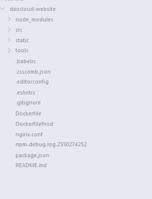
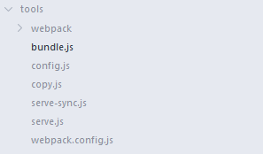

# 加速器前端总结（1）
## daocloud-website结构
daocloud-website共有四个目录，分别为“node_modules”，“src”，“static”，“tools”，还有一些文件，如下图:



首先解释一下这些文件，有些是知道的，有些是不知道在网上查找的。(大多数都是查找的，笑)

1. .babelrc

什么是 ``.babelrc`` 文件呢？经过网上查找，找到了答案。

对于熟悉linux的同学一定知道，rc结尾的文件通常代表运行时自动加载的文件，配置等等的，类似bashrc，zshrc。同样babelrc在这里也是有同样的作用的，而且在babel6中，这个文件必不可少。

* 里面可以对babel命令进行配置，以后在使用babel的cli的时候，可以少写一些配置
* 还有一个env字段，可以对BABEL_ENV或者NODE_ENV指定的不同的环境变量，进行不同的编译操作
* “presets”，这个是babel6新加的，就是代表需要启动什么样的预设转码，在babel6中，预设了6种，分别是
    * es2015
    * stage-0
    * stage-1
    * stage-2
    * stage-3
    * react

而且，对.babelrc的设置，你可以存放在package.json中的。如下：

```sh
{
    ···
    "babel" : {
        "presets" : ["es2015"]
    },
    ···
}
```

2. .csscomb.json

**Make your code beautiful**，这是CSScomb首页给出的一句话，显而易见，是用于美化你的CSS Code的工具。它的安装和配置也很容易在官网找到。安装之后，通过配置``.csscomb.json``文件，就可以使你的css代码风格能够统一。可以通过官网的“Build config”来配置文件。

* [官方网址](http://csscomb.com/docs)
* [npm](https://www.npmjs.com/package/csscomb)

3. .editorconfig

引一段官方的解释:

>What is EditorConfig?
>ditorConfig helps developers define and maintain consistent coding styles between different editors and IDEs. The EditorConfig project consists of a file format for defining coding styles and a collection of text editor plugins that enable editors to read the file format and adhere to defined styles. EditorConfig files are easily readable and they work nicely with version control systems.

感觉很好翻译和理解，所以就说说``.editorconfig``文件，下面是一个用于JavaScript和Python的配置:

```sh
# EditorConfig is awesome: http://EditorConfig.org

# top-most EditorConfig file
root = true

# Unix-style newlines with a newline ending every file
[*]
end_of_line = lf
insert_final_newline = true

# Matches multiple files with brace expansion notation
# Set default charset
[*.{js,py}]
charset = utf-8

# 4 space indentation
[*.py]
indent_style = space
indent_size = 4

# Tab indentation (no size specified)
[Makefile]
indent_style = tab

# Indentation override for all JS under lib directory
[lib/**.js]
indent_style = space
indent_size = 2

# Matches the exact files either package.json or .travis.yml
[{package.json,.travis.yml}]
indent_style = space
indent_size = 2
```

感觉配置文件还是挺好理解的，如果以后要是有了问题，再来继续填坑。

[官网](http://editorconfig.org/)

3. .eslintrc

它是ESLint的配置文件。ESLint是一个QA工具，用来避免低级错误和统一代码的风格。ESLint被设计为完全可配置的，主要有两种方式来配置ESLint:

* 在注释中配置：使用JavaScript注释直接把配置嵌入到文件中。
* 配置文件：使用一个JSON或YAML文件来为全部的目录和它的子目录指定配置信息。

有很多信息是可以被配置的：

* Environments：你的脚步将要运行在什么环境中。
* Globals：额外的全局变量。
* Rules：开启规则和发生错误时报告的等级。

*安装*

```sh
npm install -g eslint
```

*使用方法*
如果你的项目还没有配置文件（.eslintrc）的话，可以通过指定--init参数来生成一个新的配置文件：

```sh
eslint --init
```

然后，就可以在任何JavaScript中运行ESLint了。

*配置*
运行eslint --init后，会在当前目录下生成一个.eslintrc文件，你可以在这个文件中配置一些规则。

规则的错误等级有三种：

* 0：关闭规则。
* 1：打开规则，并且作为一个警告（不影响exit code）。
* 2：打开规则，并且作为一个错误（exit code将会是1）。

具体的规则可以在官网上找到，或者使用别人写好的配置，例如[eslint-config-standard](https://github.com/feross/eslint-config-standard)。

4. .gitignore

这个就不多说了，git忽略的文件。

5. Dockerfile

这个待补充

6. DockerfileProd

同上

7. nginx.conf

Nginx服务器配置

8. package.json

9. README.md

然后我们来看一下四个目录下的内容:

## daocloud-website具体信息

### 1. /tools

如图:



先说一下关于**webpack.config.js**这个文件吧。


### 2. /static

1. crossdomain.xml

*格式*

* 根节点有一个``<cross-domain-policy>``
* 其下包含一个或多个``<allow-access-from>``节点
* ``<allow-access-from>``有一个属性``domain``，其值为允许访问的域，可以是确切的 IP 地址、一个确切的域或一个通配符域（任何域）

Example:

```xml
<?xml version="1.0" encoding="UTF-8"?>
<!DOCTYPE cross-domain-policy SYSTEM "http://www.adobe.com/xml/dtds/cross-domain-policy.dtd">
<cross-domain-policy>
<allow-access-from  domain="*" />
</cross-domain-policy>
```

参考网址:
http://blog.sina.com.cn/s/blog_995b1afd0101csbq.html
http://www.cnblogs.com/kenkofox/p/3631339.html