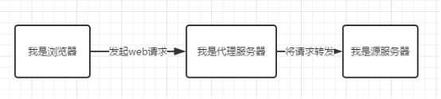
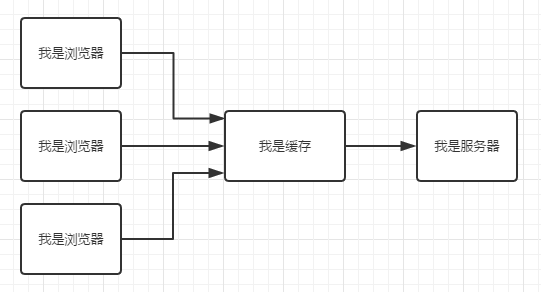
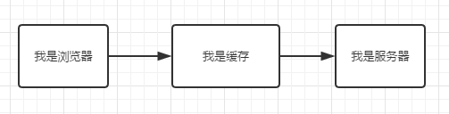
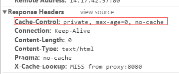
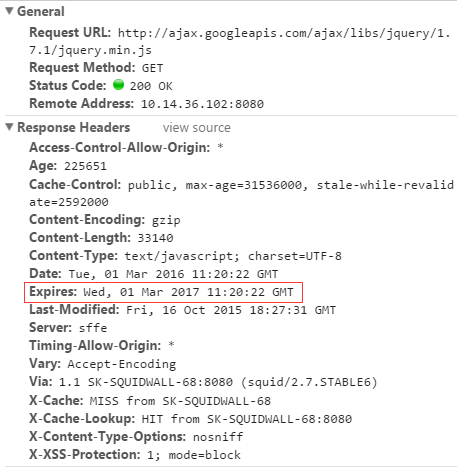
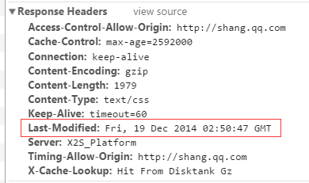
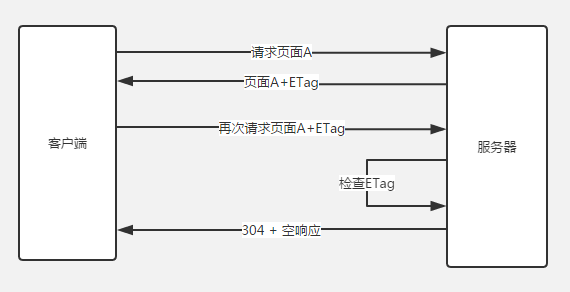
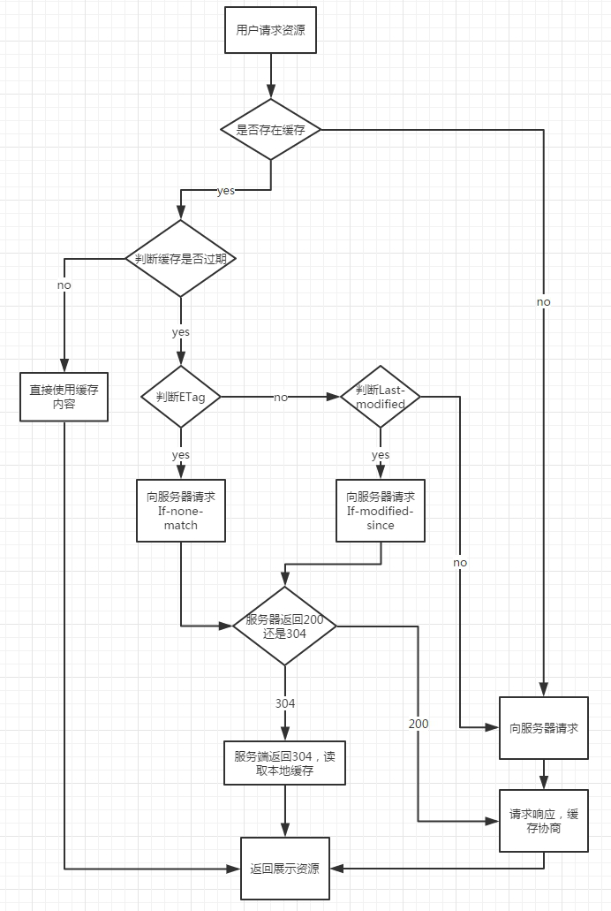

# 浅谈web缓存
## 缓存分类
web缓存分为很多种，比如数据库缓存，服务器缓存，CDN缓存，浏览器缓存。 浏览器通过代理服务器向源服务器发起请求的原理如下图， 

浏览器先向代理服务器发起web请求，再将请求转发到源服务器。它属于共享缓存，所以很多地方都可以使用其缓存，因此对于节省流量有很大作用。

浏览器缓存是将文件保存在客户端，在同一个会话过程中会检查缓存的副本是否足够新，在后退网页时，访问过的资源可以从浏览器缓存中拿出来使用。通过减少服务器处理请求的数量，用户将获得更快的体验。

## 浏览器缓存
页面的缓存状态是由header决定的，header的参数有四种:

### 一、Cache-Control：
- max-age(单位为s)指定设置缓存最大的时间，定义的时间长短。当浏览器向服务器发送请求后，在max-age这段时间里浏览器就不会再向服务器发送请求了。 **max-age会覆盖掉Expires**
- s-maxage(单位s)同max-age，只用于共享缓存(比如CDN缓存)。 **如果存在s-maxage，则会覆盖掉max-age和Expires header。**
- public指定响应会被缓存，并且在多用户间共享。也就是下图的意思。如果没有指定public还是private，则默认为public

  

- private响应只作为私有的缓存(见下图)，不能再用户间共享。如果要求HTTP认证，相应会自动设置为private.

  

- no-cache指定不缓存的响应，表明资源不进行缓存，比如:

  

- 但设置了no-cache之后并不代表浏览器不缓存，而是在缓存前要想服务器确定资源是否被更改。因此有的时候只设置no-cache放置缓存还是不够保险，还可以加上private指令，将过期时间设置为过去的时间。
- no-store绝对禁止缓存，一看就知道如果用了这个命令当然就是不会进行缓存啦~每次请求资源都要从服务器重新获取。
- must-revalidate指定如果页面是过期的，则去服务器进行获取。这个指令并不常用，就不做过多的讨论了。

### 二、Expires
缓存过期时间，用来指定资源到期的时间，是服务器端的具体的时间点。也就是说，Expires=max-age + 请求时间，需要的Last-modified结合使用。但是在上面我们提到过，Cache-Control的优先级更高。Expires是Web服务器响应消息头字段，在响应Http请求时告诉浏览器在过期时间前浏览器可以直接从浏览器缓存取数据，而无需在此请求。 

### 三、Last-modified
 服务器端文件的最后修改时间，需要和cache-control共同使用，是检查服务器端资源是否更新的一种方式。当浏览器再次进行请求时，会向服务器传送If-Modified-Since报头，询问Last-Modified时间点之后资源是否被修改过。如果没有修改，则返回码为304，使用缓存；如果修改过，则再次去服务器请求资源，返回码和首次请求相同为200，资源为服务器最新资源。

如下图，最后修改时间为2014年12月19日星期五2点50分47秒 

### 四、ETAG
根据实体内容生成一段hash字符串，标识资源的状态，由服务端产生。浏览器会将这串字符串传回服务器，验证资源是否已经修改，如果没有修改，过程如下: 

使用ETag可以解决Last-modified存在的一些问题：
1. 某些服务器不能精确得到资源的最后修改时间，这样就无法通过最后修改时间判断资源是否更新
2. 如果资源修改非常频繁，在秒以下的时间内进行修改，而Last-modified只能精确到秒
3. 一些资源的最后修改时间改变了，但是内容没改变，使用ETag就认为资源还是没有修改的。

## 使用缓存流程

## cache-control指令使用
说了那么多cache-control的指令，那么如何选择使用哪些指令呢？我还是不说话== 

## 额外的
除了开头提到的那么多缓存方式以外，还有一种我们都熟悉的缓存方式，LocalStorage和sessionStorage

LocalStorage是一种本地存储的公共资源，域名下很多应用共享这份资源会有风险；LocalStorage是以页面域名划分的，如果有多个等价域名之间的LocalStorage不互通，则会造成缓存多份浪费。

LocalStorage在PC上的兼容性不太好，而且当网络速度快、协商缓存响应快时使用localStorage的速度比不上304。并且不能缓存css文件。而移动端由于网速慢，使用localStorage要快于304

而相对LocalStorage来说，SessionStorage的数据只存储到特定的会话中，不属于持久化的存储，所以关闭浏览器会清除数据。和localstorage具有相同的方法。

在前端开发中缓存是必不可少的，那么使用怎样的缓存方式更高效、让我们项目的性能更优，还是需要我们仔细斟酌。

**文章为AlloyTeam所有，只为自身学习使用**

[原创文章地址](http://www.alloyteam.com/2016/03/discussion-on-web-caching/)
