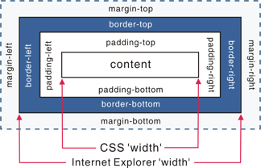

# Quirks模式是什么？它和Standards模式有什么区别
从IE6开始，引入了Standards模式，标准模式中，浏览器尝试给符合标准的文档在规范上的正确处理达到在指定浏览器中的程度。

　　在IE6之前CSS还不够成熟，所以IE5等之前的浏览器对CSS的支持很差， IE6将对CSS提供更好的支持，然而这时的问题就来了，因为有很多页面是基于旧的布局方式写的，而如果IE6 支持CSS则将令这些页面显示不正常，如何在即保证不破坏现有页面，又提供新的渲染机制呢？

　　在写程序时我们也会经常遇到这样的问题，如何保证原来的接口不变，又提供更强大的功能，尤其是新功能不兼容旧功能时。遇到这种问题时的一个常见做法是增加参数和分支，即当某个参数为真时，我们就使用新功能，而如果这个参数 不为真时，就使用旧功能，这样就能不破坏原有的程序，又提供新功能。IE6也是类似这样做的，它将DTD当成了这个"参数"，因为以前的页面大家都不会去写DTD，所以IE6就假定 如果写了DTD，就意味着这个页面将采用对CSS支持更好的布局，而如果没有，则采用兼容之前的布局方式。这就是Quirks模式（怪癖模式，诡异模式，怪异模式）。

区别：

　　总体会有布局、样式解析和脚本执行三个方面的区别。

　　盒模型：在W3C标准中，如果设置一个元素的宽度和高度，指的是元素内容的宽度和高度，而在Quirks 模式下，IE的宽度和高度还包含了padding和border。  设置行内元素的高宽：在Standards模式下，给<span>等行内元素设置wdith和height都不会生效，而在quirks模式下，则会生效。

　　设置百分比的高度：在standards模式下，一个元素的高度是由其包含的内容来决定的，如果父元素没有设置百分比的高度，子元素设置一个百分比的高度是无效的用margin:0 auto设置水平居中：使用margin:0 auto在standards模式下可以使元素水平居中，但在quirks模式下却会失效。

## 补充
### 图片元素的垂直对齐方式
对于inline元素和table-cell元素，在IE Standards Mode下Vertical-align(垂直对齐)属性默认取值为baseline。而inline元素的内容只有图片时，如table的单元格table-cell。在IE Quirk Mode下，table单元格中的图片的Vertical-align属性默认为bottom，因此，在图片底部会有几像素的空间。

### ``<table>``元素中的字体:
CSS中，描述font的属性有font-family,font-size,font-style,font-weight,上述属性都是可以继承的。而在IE Quirks Mode下，对于table元素，字体的某些属性将不会从body或其他封闭元素继承到table中，特别是font-size属性.

### 内联元素的尺寸
在 IE Standards Mode 下，non-replaced inline 元素无法自定义大小，而在 IE Quirks Mode 下，定义这些元素的width和height 属性，能够影响该元素显示的大小尺寸。

### 元素的百分比高度:
CSS 中对于元素的百分比高度规定如下，百分比为元素包含块的高度，不可为负值。如果包含块的高度没有显式给出，该值等同于"auto"（即取决于内容的高度）。所以百分比的高度必须在父元素有声明高度时使用。

当一个元素使用百分比高度时，在 IE Standards Mode 下，高度取决于内容的变化，而在 Quirks Mode 下，百分比高度则被正确应用

### 元素溢出的处理
在 IE Standard Mode 下，overflow取默认值 visible，即溢出可见，这种情况下，溢出内容不会被裁剪，呈现在元素框外。而在 Quirks Mode 下，该溢出被当做扩展box来对待，即元素的大小由其内容决定，溢出不会被裁剪，元素框自动调整，包含溢出内容。

# div+css的布局较table布局有什么优点？
- 改版的时候更方便 只要改css文件。
- 页面加载速度更快、结构化清晰、页面显示简洁。
- 表现与结构相分离。
- 易于优化（seo）搜索引擎更友好，排名更容易靠前。

# a：img的alt与title有何异同？b：strong与em的异同？
## a
- alt(alt text):为不能显示图像、窗体或applets的用户代理（UA），alt属性用来指定替换文字。替换文字的语言由lang属性指定。(在IE浏览器下会在没有title时把alt当成 tool tip显示)
- title(tool tip):该属性为设置该属性的元素提供建议性的信息。

## b
- strong:粗体强调标签，强调，表示内容的重要性
- em:斜体强调标签，更强烈强调，表示内容的强调点

# 你能描述一下渐进增强和优雅降级之间的不同吗?
- 渐进增强 progressive enhancement：针对低版本浏览器进行构建页面，保证最基本的功能，然后再针对高级浏览器进行效果、交互等改进和追加功能达到更好的用户体验。
- 优雅降级 graceful degradation：一开始就构建完整的功能，然后再针对低版本浏览器进行兼容。

区别：优雅降级是从复杂的现状开始，并试图减少用户体验的供给，而渐进增强则是从一个非常基础的，能够起作用的版本开始，并不断扩充，以适应未来环境的需要。降级（功能衰减）意味着往回看；而渐进增强则意味着朝前看，同时保证其根基处于安全地带。

# 为什么利用多个域名来存储网站资源会更有效？
- CDN缓存更方便
- 突破浏览器并发限制
- 节约cookie带宽
- 节约主域名的连接数，优化页面响应速度
- 防止不必要的安全问题

# 请描述一下cookies，sessionStorage和localStorage的区别？　
sessionStorage用于本地存储一个会话（session）中的数据，这些数据只有在同一个会话中的页面才能访问并且当会话结束后数据也随之销毁。因此sessionStorage不是一种持久化的本地存储，仅仅是会话级别的存储。而localStorage用于持久化的本地存储，除非主动删除数据，否则数据是永远不会过期的。

## web storage和cookie的区别
- Web Storage的概念和cookie相似，区别是它是为了更大容量存储设计的。Cookie的大小是受限的，并且每次你请求一个新的页面的时候Cookie都会被发送过去，这样无形中浪费了带宽，另外cookie还需要指定作用域，不可以跨域调用。
- 除此之外，Web Storage拥有setItem,getItem,removeItem,clear等方法，不像cookie需要前端开发者自己封装setCookie，getCookie。但是Cookie也是不可以或缺的：Cookie的作用是与服务器进行交互，作为HTTP规范的一部分而存在 ，而Web Storage仅仅是为了在本地"存储"数据而生。

# 简述一下src与href的区别。
src用于替换当前元素，href用于在当前文档和引用资源之间确立联系。

src是source的缩写，指向外部资源的位置，指向的内容将会嵌入到文档中当前标签所在位置；在请求src资源时会将其指向的资源下载并应用到文档内，例如js脚本，img图片和frame等元素。

```html
<script src ="js.js"></script>
```

当浏览器解析到该元素时，会暂停其他资源的下载和处理，直到将该资源加载、编译、执行完毕，图片和框架等元素也如此，类似于将所指向资源嵌入当前标签内。这也是为什么将js脚本放在底部而不是头部

href是Hypertext Reference的缩写，指向网络资源所在位置，建立和当前元素（锚点）或当前文档（链接）之间的链接，如果我们在文档中添加

```html
<link href="common.css" rel="stylesheet"/>
```

那么浏览器会识别该文档为css文件，就会并行下载资源并且不会停止对当前文档的处理。这也是为什么建议使用link方式来加载css，而不是使用@import方式。

# 知道的网页制作会用到的图片格式有哪些？
png-8，png-24，jpeg，gif，svg, **Webp,Apng**。

科普一下Webp：WebP格式，谷歌（google）开发的一种旨在加快图片加载速度的图片格式。图片压缩体积大约只有JPEG的2/3，并能节省大量的服务器带宽资源和数据空间。Facebook Ebay等知名网站已经开始测试并使用WebP格式

在质量相同的情况下，WebP格式图像的体积要比JPEG格式图像小40%。

Apng：全称是"Animated Portable Network Graphics", 是PNG的位图动画扩展，可以实现png格式的动态图片效果。04年诞生，但一直得不到各大浏览器厂商的支持，直到日前得到 iOS safari 8的支持，有望代替GIF成为下一代动态图标准。

# 知道什么是微格式吗？谈谈理解。在前端构建中应该考虑微格式吗？
微格式（Microformats）是一种让机器可读的语义化XHTML词汇的集合，是结构化数据的开放标准。是为特殊应用而制定的特殊格式。

优点：将智能数据添加到网页上，让网站内容在搜索引擎结果界面可以显示额外的提示

# 在css/js代码上线之后开发人员经常会优化性能，从用户刷新网页开始，一次js请求一般情况下有哪些地方会有缓存处理？
dns缓存，cdn缓存，浏览器缓存，服务器缓存。

# 一个页面上有大量的图片（大型电商网站），加载很慢，你有哪些方法优化这些图片的加载，给用户更好的体验。
- 图片懒加载，在页面上的未可视区域可以添加一个滚动条事件，判断图片位置与浏览器顶端的距离与页面的距离，如果前者小于后者，优先加载。
- 如果为幻灯片、相册等，可以使用图片预加载技术，将当前展示图片的前一张和后一张优先下载。
- 如果图片为css图片，可以使用CSSsprite，SVGsprite，Iconfont、[Base64](http://baike.baidu.com/link?url=gsDy4iG4mnU2acBn79xROGtlMIUyUZB3sHIcWPxfUtmZ5IPm9lFrfGvgsOHv6J5_AvMvcmPandDUwkHNvk5wcq等技术。)
- 如果图片过大，可以使用特殊编码的图片，加载时会先加载一张压缩的特别厉害的缩略图，以提高用户体验。
- 如果图片展示区域小于图片的真实大小，则因在服务器端根据业务需要先行进行图片压缩，图片压缩后大小与展示一致

# 你如何理解HTML结构的语义化？　　
- 去掉或样式丢失的时候能让页面呈现清晰的结构
- 屏幕阅读器（如果访客有视障）会完全根据你的标记来"读"你的网页
- PDA、手机等设备可能无法像普通电脑的浏览器一样来渲染网页（通常是因为这些设备对CSS的支持较弱）
- 搜索引擎的爬虫也依赖于标记来确定上下文和各个关键字的权重
- 你的页面是否对爬虫容易理解非常重要,因为爬虫很大程度上会忽略用于表现的标记,而只注重语义标记.
- 便于团队开发和维护

# 谈谈以前端角度出发做好SEO需要考虑什么？
- 了解搜索引擎如何抓取网页和如何索引网页

  [https://segmentfault.com/a/1190000000595223](https://segmentfault.com/a/1190000000595223)

  [https://segmentfault.com/a/1190000000627399](https://segmentfault.com/a/1190000000627399)

- Meta标签优化

  主要包括主题(title), 网站描述(Description)和关键词(Keywords)。还有一些其他的隐藏文字比如Author(作者),Category(目录)，Language(编码语句)等。

- 如何选取关键词并在网页中放置关键词

  搜索就得用关键词。关键词分析和选择是SEO最重要的工作之一。首先要给网站确定主关键词(一般在5个上下)，然后针对这些关键词进行优化，包括关键词密度(Density),相关度(Relavancy)，突出性(Prominency)等等。

- 了解主要的搜索引擎

  虽然搜索引擎有很多，但是对网站流量起决定作用的就那么几个。比如英文的主要有Google，Yahoo，Bing等；中文的有百度，搜狗，有道等。不同的搜索引擎对页面的抓取和索引、排序的规则都不一样。还要了解各搜索门户和搜索引擎之间的关系，比如AOL网页搜索用的是Google的搜索技术，MSN用的是Bing的技术。

- 链接交换和链接广泛度（Link Popularity）

  网页内容都是以超文本（Hypertext）的方式来互相链接的，网站之间也是如此。除了搜索引擎以外，人们也每天通过不同网站之间的链接来Surfing（"冲浪"）。其它网站到你的网站的链接越多，你也就会获得更多的访问量。更重要的是，你的网站的外部链接数越多，会被搜索引擎认为它的重要性越大，从而给你更高的排名。

- 合理的标签使用
