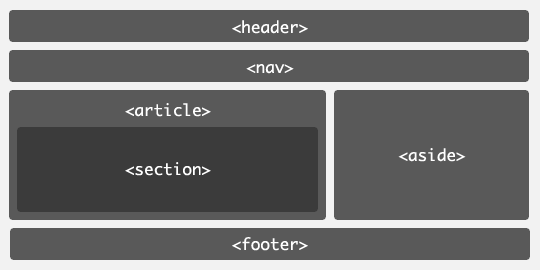

# html5新特性(1)
## 特性一:Drag & Drop
HTML5为元素新增了用于拖拽的属性draggable，这个属性决定了元素是否能被拖拽， 如果draggable="true"，则元素可被拖拽，否则只能选择元素的文本。如下代码：

```html
<p draggable="true" ondragstart="alert('dragstart')">Drag me ! Darg me!!</p>
```

如果拖动"Drag me!Drag me!!"这个，会弹出alert消息框。 同样的定义其他拖拽事件如ondragenter、ondragover、ondragover、ondrop等的动作函数就可以完成一个完整的拖拽动作，实现想要实现的目的

## 特性二:正则表达式
相信大家都会非常喜欢这个特性，无须服务器端的检测，使用浏览器的本地功能就可以帮助你判断电子邮件的格式，URL，或者是电话格式，防止用户输入错误的信息，通过使用HTML5的pattern属性，我们可以很方便的整合这个功能，代码如下：

```html
<input type="email" pattern="[^ @]*@[^ @]" value="" />
```

如果在Firefox浏览器中运行，并且输入错误的email地址，会看到红框提示的效果。

## 特性三:数据列表元素
在没有HTML5的日子里，我们会选择使用一些JS或者知名的jQuery UI来实现自动补齐的功能，而在HTML5中，我们可以直接使用datalist元素，如下：

```html
<form action="www.camnpr.com">
<input list="jslib" name="js">
<datalist id="jslib">
  <option value="jQuery">
  <option value="Dojo">
  <option value="Prototype">
  <option value="Augular">
</datalist>
<input type="submit" value="完成">
</form>
```

## 特性四:下载属性
HTML5的下载属性可以允许开发者强制下载一个页面，而非加载那个页面，这样的话，你不需要实现服务器端的一些功能来达到同样的效果，是不是非常贴心？

```html
<a href="http://camnpr.com/download_pdf.php" download="somefile.pdf">下载PDF</a>
```

## 特性五：DNS的预先加载处理
要知道DNS的的解析成本很高滴，往往导致了网站加载速度慢。现在浏览器针对这个问题开发了更智能的处理方式，它将域名缓存后，当用户点击其它页面地址后自动的获取。 如果你希望预先获取NDS，你可以控制你的浏览器来解析域名，例如：

```html
<link rel="dns-prefetch" href="//www.camnpr.com">
<link rel="dns-prefetch" href="//www.kuabaobao.com">
<link rel="dns-prefetch" href="//m.camnpr.com">
<link rel="dns-prefetch" href="//s.camnpr.com">
```

其他资料:[http://blog.csdn.net/zhongweijian/article/details/9041597](http://blog.csdn.net/zhongweijian/article/details/9041597)

## 特性六：链接网页的预先加载处理
要知道链接能够在也页面中帮助用户导航，但是页面加载的速度快慢决定了用户体验的好与坏，使用如下HTML5的prefetch属性可以帮助你针对指定的地址预加载页面或者页面中的特定资源，这样用户点击的时候，会发现页面加载速度提高了。

```html
<link rel="prefetch" href="http://camnpr.com/demo/list.html" />
<link rel="prefetch" href="http://camnpr.com/images/logo.jpg" />
```

或者可以使用prerender属性，这个属性能够帮助你提前加载整个页面，如下：

```html
<link rel="prerender" href="http://camnpr.com/search.html" />
```

## 特性七：HTML5基本布局（语义化的标签）
 其中的<section>和<article>标签值得注意，<section>标签用来分组相类似的信息，而<article>标签则应该是用来放置诸如一篇文章或是博客一类的信息，你可以在<artile>中嵌入<header>，<section>，<footer>等内容。<article>标签，正如它的名称所暗示的那样，提供了一个完整的信息包。相比之下，<section>标签包含的是有关联的信息，但这些信息自身不能被放置到不同的上下文中，因为这样的话其所代表的含义就会丢失。
