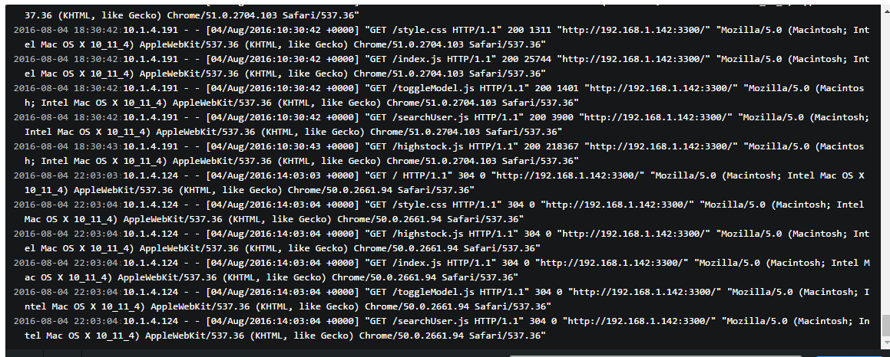

# Terminal模拟
在一些项目中，我们会经常用到像下图的terminal，像git一些网站也会有这样的效果。



当然这个还不算是个完整的terminal，因为它只能显示，不能输入命令。来看一个[github](https://try.github.io/levels/1/challenges/1)的案例:


在这个案例中我输入git之后，它在几秒钟后，返回给我git的一些相关信息。这个才算是真正的terminal。

## 什么是Terminal
在这里的Terminal效果叫做命令行控制台。通过使用JavaScript，模拟或者和后台进行交互来完成命令控制台的模拟。

## 实现
### 简单功能实现原理
一个Terminal的简单功能就是 *输入，然后输出*，简单的来说就是:

```js
function test(command, terminal) {
    if(command === 'hello') {
        terminal.echo('hello');
    }else if(command === 'what`s your name?') {
        terminal.echo('Peter');
    }else if(){
        ....
    }else {
        terminal.echo('No Command');
    }
}
```

通过简单的 ``if...else if..else`` 来实现，或者也可以通过 ``switch..case..default``。

这里 ``command`` 就是输入的命令，``terminal`` 就是用于控制输出的一个实例。

输入的实现就是通过一个特定的事件(回车，keyup等)，然后将输入的value读入。承载输入的容器，一般都会
用 ``input``。为什么会有 ``input``？想想 ``input``自带的feature。对！就是那个一闪一闪的等待输入
的竖杠，这不就是我们命令行控制台中的等待输入的那个竖杠嘛。当然也有人会使用自己定义的 ``animate``
来实现这种效果，也是可以的。

接下来要说的就是回车后的输出了，输出这一操作涉及的操作比较多:

1. 首先我们要读入的值保存起来，然后将输入部分变为不可编辑。这部分需要我们进行一些dom操作，要生成不可编辑的输入的部分，然后将之前可编辑的输出部分移除。
2. 将我们输出的部分生成并渲染。
3. 再生成可编辑的待输入的输入部分。

## SDA / terminal
github:https://github.com/SDA/terminal

这是一个十分简单的Terminal插件，源码非常容易读，适合实现一个简单的terminal。

使用方法:

1. 导入你的 ``terminal.js`` 和 ``terminal.css`` 到你的HTML文件:

```html
<script src="terminal.min.js"></script>
<link rel="stylesheet" href="terminal.min.css" media="all">
```

2. 定义一个 ``div`` 标签作为容器:

```html
<div id="terminal"></div>
```

3. 在你的js的代码中创建一个terminal实例

```js
var terminal = new Terminal('terminal', {}, {});
```

不过这样做并不会有什么效果，需要定义一些命令:

```js
var terminal = new Terminal('terminal', {}, {
    execute : function(cmd, args)     {
        switch (cmd) {
            case 'clear' : 
                terminal.clear();
                return ;
            case 'help' : 
                return 'Commands: clear, help, theme, ver or version<br>More help available <a class="external" href="http://github.com/SDA/terminal" target="_blank">here</a>';
            case 'theme' : 
                if(args && args[0]) {
                    if(args.length > 1) return 'Too many arguments';
                    else if(args[0].match(/^interlaced|modern|white$/)) {
                        terminal.setTheme(args[0]); return '';
                    }
                }
                return terminal.getTheme();
            case 'ver':
            case 'version':
                return '1.0.0';
            default : 
                return false;
        };
    }
});
```

*SDA / terminal*定义了一些自己的方法，比如:clear,setTheme等。可以直接拿来使用。

## jquery.terminal
github:https://github.com/jcubic/jquery.terminal

jquery的终端模拟器是一个在应用程序中创建命令行解释器插件。当用户输入命令的时候，它自动调用rpc服务，或者你可以提供自己的函数来解析命令。

### Features
1. 你可以用使用一行url代码来创建一个用于命令翻译的 ``JSON-RPC`` 服务
2. 支持认证
3. 


## jquery-console
github:https://github.com/chrisdone/jquery-console

## eosterberg/terminal.js
github:https://github.com/eosterberg/terminaljs

## Docker-Terminal
github:https://github.com/rainforestapp/Docker-Terminal

## ng-terminal-emulator
github:https://github.com/vtortola/ng-terminal-emulator

## wts
github:https://github.com/chemdemo/wts-monit