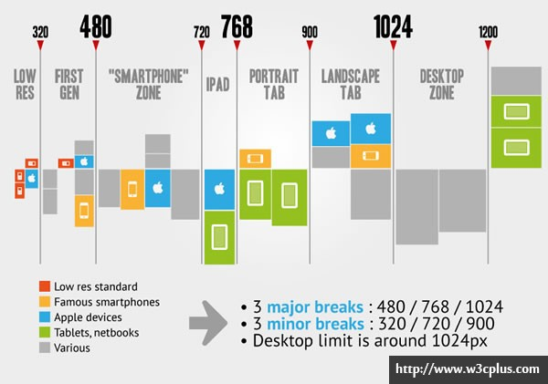
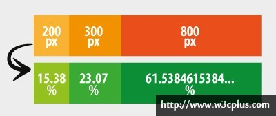

# RWD
## Responsive网页设计的主要特点

* 该网站必须建立灵活的网格基础
* 引用到网站的图片必须是可伸缩的
* 不同的显示风格，需要在media queries上写不同的样式

### 灵活的网格系统
对于现有的网格系统和自定义一个网络系统，无论我们使用现有的网格还是自己自定义的网格系统，最主要的是要让他适合我们布局的大小和间距的需要。

这样就意味着，我们需要放弃常用的“px”固定布局，而使用百分比或者“em”这样的流体布局来实现“web布局”。

当然这样并不是说我们在设计软件中不能使用“px”，我们在设计页面的图片效果时，还是在“px”的基础上实现，因为我们只是在Web页面中使用一个相对单位来实现需要的网页布局。

换句话说: **设计web页面的模型效果，我们还是使用“px”来定其大小与间距，只是在图片效果转成web页面效果时，才采用“百分比”或用“em”这样的相对单位来替代“px”，从而实现一种比较灵活的布局。**

### 灵活的图片

图片的可伸缩性实现:

```css
 img {
            max-width: 100%;
            width: 100%;
            height: auto;
          }
```

当然，如果有些图片不是很得要的话，我们还可以考虑使用“Media Queries”在不需要图片显示的情况下，
把图片隐藏起来。

## Responsive设计的十个基本技巧
### 一、保持一个简单的布布局
布局是一个在简单不过的问题了，也是每个网页设计中必须包含的部分，但我们使用Responsive设计第一步要做的事情就是 **让你的页面布局尽量的简单**。实现一个简单的布局，我们有一些小技巧：

在Responsive布局中，我们可以毫无保留的丢弃：

* 尽量少用无关紧要的div
* 不使用内联元素(inline)
* 尽量少用js或flash
* 丢去没用的绝对定位和浮动样式
* 屏弃任何冗余结构和不使用100%设置

能帮助Responsive确定更好的布局的东西:

* 使用HTML5 Doctype和相关指南
* 重置好你的样式（reset.css）
* 一个简单的有语义的核心布局
* 给重要的网页元素使用简单的技巧，比如导航菜单之类元素

### 二、使用Medial Queries

**根据用户的使用设备的当前宽度，你的Web页面将加载一个备用的样式，实现特定的页面风格**。

使用一些Media Queries模板，可以去[CSS Media Queries](CSS Media Queries.md)

可以通过下图来进行尺寸的决定:



### 三、定义断点

定义断点，那么断点是什么？简单的描述就是，设备宽度的临界点，也就是前面大家比较关心的Medial Queries中的min-width和max-width值是什么？那么在Responsive设计中，常见的断点有六种，我们今后的Medial Queries条件判断就可以根据这六个断点来定。

主要的有：

* 第一个断点群体就是针对于智能手机设置，他的宽度是小于480px（< 480px）
* 第二个断点是高智能移动设备，比如说Ipads设备，他的宽度是小于768px（< 768px）
* 第三个断点就是针对于大设备，比如说PC端，他的宽度是大于768px（> 768px）

为了完美一些，我们还可以添加另外几种断点：

* 添加一个小于320px的断点，针对于小型的移动设备；(< 320px)
* 还可以添加适用于平板设备的断点，大于768px小于1024px(>768px 和 < 1024px)
* 最后还可以为超宽的桌面设置一个断点，大于1024px(>1024px)

综合下来，设置断点把握三个要点：

* 满足主要的断点；
* 有可能的话添加一些别的断点；
* 设置高于1024px的桌面断点

### 四、让你的布局更灵活

断点确认了，接下来要让你的布局更具灵活性。这里推荐使用flexible grids来布局，相对于固定宽度布局而言，Flexible grids能让你的布局更适应于viewport的尺寸大小。而整个flexible grids中流体布局（也就是大家常说的自适应布局、液体布局、百分比布局）最适合各种类弄屏幕大小，结合正确的medial Queries，你可以制作出适应于任何可能出现的设备页面布局。

来看一个简单的对比图



使用流体布局，有一个小技巧注意，为了让浏览器计算小数点的四舍五入的问题，影响页面布局，所以你的百分比小数位尽量多取一些位数，（如果你有看bootstrap的源码，你就能很明显的看到他的百分比布局，小数点后面精确到十多位）。当然大家对这个数值不好把握的话，可以使用现成的网格系统：

* [30+ CSS Grid System](http://www.w3cplus.com/source/30-css-grid-system.html)
* [8个实用的响应式设计框架](http://www.w3cplus.com/source/8-useful-responsive-css-frameworks.html)

还有一个小技巧就是通过设置``box-sizing``来使你的box module不会很混乱。

```css
*{
  -webkit-box-sizing: border-box;
  -moz-box-sizing: border-box;
  -o-box-sizing: border-box;
  -ms-box-sizing: border-box;
  box-sizing: border-box;
}
```

### 五、图片的自适应

*图片自适应大小*

```css
img{
    max-width:100%;
}
```

*断点图片*
为每一个断点提供不同的的图片，这是一个比较头痛的事情，因为Medial Queries并不能改变图片"src"的属性值，那有没有办法可以解决呢？可以参考一下下面的解决方法：

* 使用background-image:给元素使用背景图片，
* 显示/隐藏父元素：给父元素使用不同的图片，然后通过Medial Queries来控制这些图片显示或隐藏。

```html

```

```css
@media (min-device-width:600px) {
    img[data-src-600px] {
        content:attr(data-src-60px, url);
    }
}
@media (min-device-width:800px) {
    img[data-src-800px] {
        content:attr(data-src-800px, url);
    }
}
```

### 六、别忘了min和max

在Responsive中有两个关键词也是非常的重要，“min-width”和“max-width”。这两个属性值能帮助你定义responsive临界点的一个相对值。典型的好处：

* 防止你的布局变大或变小
* 结合液体布局，max-width和min-width在medial queries临界点（断点）能做到更好的适应性。

### 七、让大部分东西是相对的

让你整个Web元素都是相对的而不是绝对的，从这一个概念出发，我们可以给最外面的元素定义一个单位，然后其子元素和后代码元素都继承他。目前使用相对的单位有两种常见的：

*  百分比（%）方法：给主容器定认一个固定尺寸或者流体尺寸，然后给其每个子元素使用百分比（%）来计算各自的参数，比如说width/padding/margin等；
* “em”单位：先在一个主容器中或者"``<body>``"中定义一个字体大小（font-size），把它做为基本单位，
然后其他元素以此做为基准来计算出相关的值

### 八、移动端上的效果

对于从PC端布局转换为移动端布局，只需要在mobile样式表中覆盖每一个元素的宽度，将原来的宽度转换为100%

对于不重要的元素，我们可以通过添加类``.not_mobile``，然后在手机样式中添加:

```css
@media screen and (max-width:300px) {
    .not_mobile{
        display:none;
    }
}
```

### 十、检查你的viewport

```html
<meta name="viewport" content="width=device-width">
```

## Responsive列布局

通过使用``nth-of-type``来替换使用``first``和``last``类来消除第一个列和最后一个列之间的margin。

我们可以使用":nth-of-type(An+B)"表达来代替“first”和“last”类名清除相对应的margin值。例如：

*  .grid4.col:nth-of-type(4n+1)=四列布局中的第一个（相当于first类名），也就是说等于在“1,5,9”列上添加类名“first”
* .grid3.col:nth-of-type(3n+1)=三列布局中的第一个（相当于first类名），也就是说等于“1,4,7”列上添加类名“first”
*  .grid2.col:nth-of-type(2n+1)=两列布局中的第一个（相当于first类名），也就是说等于“1,3,5”列上添加类名“first”

```css
.grid4 .col:nth-of-type(4n+1),
.grid3 .col:nth-of-type(3n+1),
.grid2 .col:nth-of-type(2n+1) {
  margin-left: 0;
  clear: left;
}
```

然后我们结合使用Media Queries实现Responsive:

初始下:

```css
/* col */
.col {
  background: #eee;
  float: left;
  margin-left: 3.2%;
  margin-bottom: 30px;
}

/* grid4 col */
.grid4 .col {
  width: 22.6%;
}

/* grid3 col */
.grid3 .col {
  width: 31.2%;
}

/* grid2 col */
.grid2 .col {
  width: 48.4%;
}
```

1. 实现四列向三列转换

当视窗小于740px的宽度时，将实现四列向三列转换，在这个转换过程中我们要做的是：

* 将“.grid4.col”的列宽度调整到“31.2%”(相当于三分之一的宽度)；
* 重置"margin-left"和“clear”值；
* 重新使用“nth-of-type(3n+1)”设置margin和clear的值

```css
@media screen and (max-width: 740px) {
  .grid4 .col {
    width: 31.2%;
  }
  .grid4 .col:nth-of-type(4n+1) {
    margin-left: 3.2%;
    clear: none;
  }
  .grid4 .col:nth-of-type(3n+1) {
    margin-left: 0;
    clear: left;
  }
}
```

2. 由四列和三列向两列转换

当视窗的宽度小于“600px”时，我们列布局由四列和三列向两列转换，表面上看来好像要复杂一些，其实他们使用的原理和前面的是一样的，先分别调整列宽和重置margin与clear:

```css
@media screen and (max-width: 600px) {
  /* change grid4 to 2-column */
  .grid4 .col {
    width: 48.4%;
  }
  .grid4 .col:nth-of-type(4n+1) {
    margin-left: 3.2%;
    clear: none;
  }
  .grid4 .col:nth-of-type(2n+1) {
    margin-left: 0;
    clear: left;
  }

  /* change grid3 to 2-column */
  .grid3 .col {
    width: 48.4%;
  }
  .grid3 .col:nth-of-type(3n+1) {
    margin-left: 3.2%;
    clear: none;
  }
  .grid3 .col:nth-of-type(2n+1) {
    margin-left: 0;
    clear: left;
  }
}
```

3. 所有列全屏显示

当视窗宽度小于“400px”时，设置所有列的宽度为“100%”，同时重置margin和float：

```css
@media screen and (max-width: 400px) {
  .col {
    width: 100% !important;
    margin-left: 0 !important;
    clear: none !important;
  }
}
```

### IE8一下的兼容

Media Queries和“nth-of-type”都不支持IE8以及其以下版本。你可以使用selectivizr.js脚本来提供nth-of-type在IE下的兼容问题和使用respond.js来做Media Queries在IE下的兼容。不过遗憾的是这两个脚本不能很好的在一起运行（比如说，nth-of-type无法在Media Queries内运行）。也就是说在IE底下无法实现Responsive列布局的四列向三列或两列转换。

更多文章见原文:http://www.w3cplus.com/css3/responsive-column-layouts.html

## 响应式导航菜单在移动端的制作方法与解决方案
http://www.w3cplus.com/css3/responsive-mobile-navigation-menumethods-and-solutions.html

## 响应式设计的未来——Flexbox（待看）
http://www.w3cplus.com/css3/responsive-design-of-the-future-with-flexbox.html

## 一些网站
http://www.w3cplus.com/css3/responsive-web-design.html