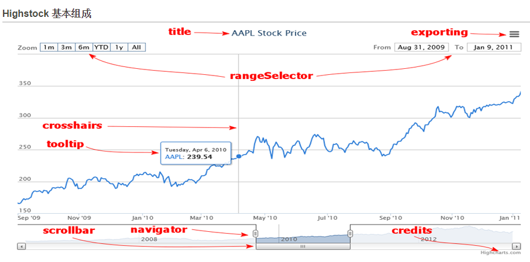

# Highcharts Document

## 基本组成示意图


## 全局配置
### 基本构成
```js
Highcharts.setOptions(ConfigObject);
```

### ConfigObject
```js
ConfigObject = {
  global : {},
  lang : {}
}
```

### global
```js
global : {
  Date : undefined,
  VMLRadialGradientURL : ,
  getTimezoneOffset : ,
  timezoneOffset : 0,
  useUTC : true
}
```

* Date : 需要Object, 一个Date类，Date类的扩展类比如 JDate
* VMLRadialGradientURL : 需要String 默认为 ``http://code.highcharts.com/highstock/{version}/gfx/vml-radial-gradient.png.``
